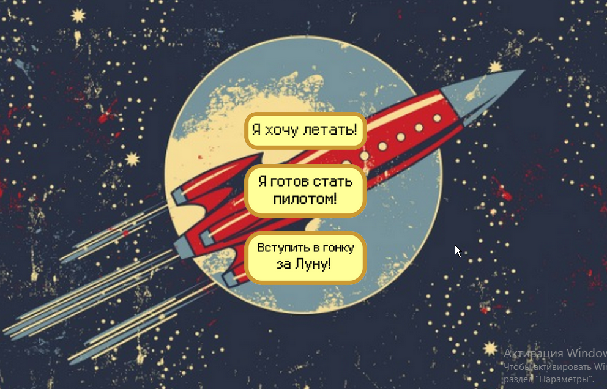
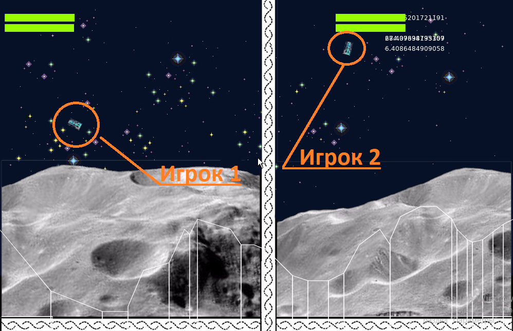
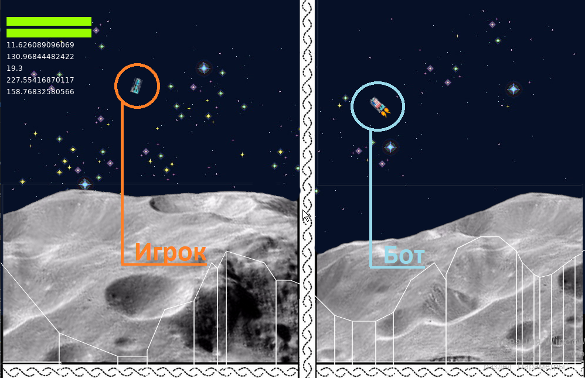

# А ну-ка посади ракету на Луну (very simplified version)
Игра, в которой надо посадить ракету на Луну.
Есть одиночный режим, соревнование с ботом и multiplayer.
Была создана мною за 8 дней, на заре становления меня программистом.

## Download

  - [game][game] - архив с файлами игры (запускать game.exe)

## Gameplay

Управление ракетой происходит по нажатию клавиш "A" (левый двигатель) и "D" (правый двигатель).
Также поддерживается нажатия клавиш "←" и "→" для управления соответствующими двигателями.
В режиме multiplayer для управления ракетой первого игрока используются клавиши "A" и "D",
для управления ракетой второго игрока - клавиши "←" и "→".

Задача игры - посадить ракету на ровную поверхность луны.
Не все ровные поверхности подходят для посадки. 
Выяснить, какая подходит, а какая - нет, - тоже задача игрока. Как?
Очень просто! попытаться посадить ракету на эту поверхность!
Если окно с оповещением о победе не появилось, то поверхность не является подходящей!

Но будь осторожен и экономь топливо! оно кончается ОЧЕНЬ быстро!

Ракета не должна приземляться на слишком большой скорости!
Она разобьётся! 

Ракета не должна иметь слишком большого угла наклона относительно поверхности при посадке!
В противном слчае - ты разобьёшься и провалишь лунную гонку!

## Screenshots

[game]: https://drive.google.com/file/d/1WLN9TjLouAvgvkLq1vyuEYQavlaw86_c/view?usp=sharing
  
